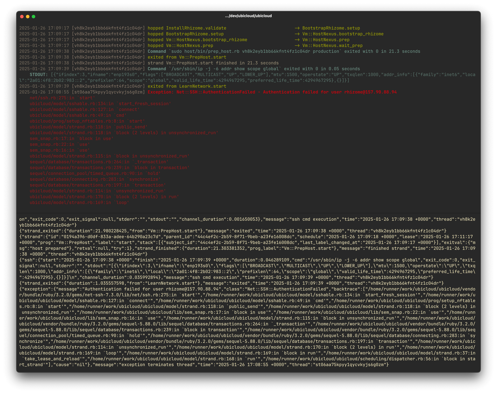
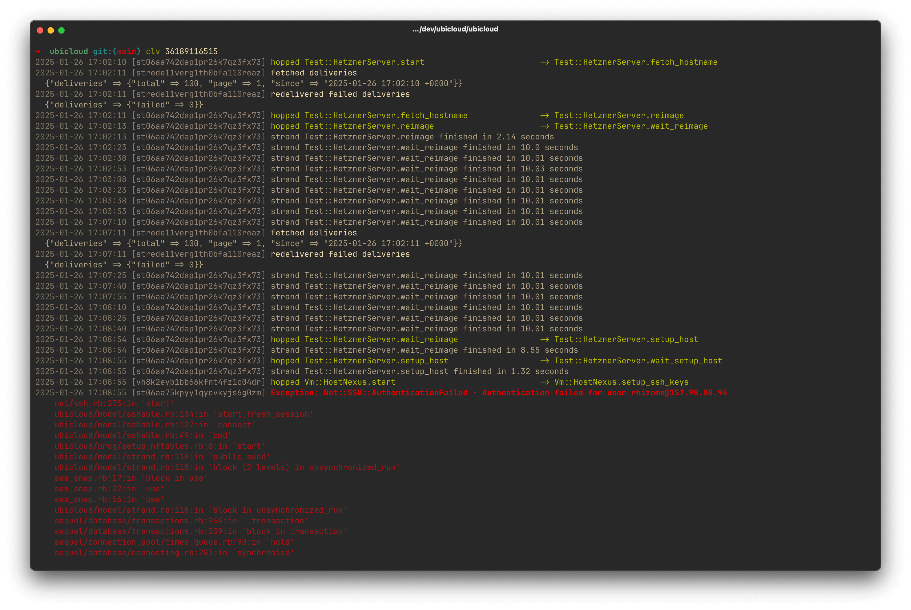

# Clover Log Viewer

`clv` is a simple tool for viewing logs from the [respirate app of Ubicloud](https://github.com/ubicloud/ubicloud/blob/main/bin/respirate) in a prettier format.



This is a personal project, so feel free to use or fork it.

Some decisions were made based on my personal preferences, so if it doesn't meet your needs, you can fork it and make it your own.

## Usage

It reads JSON line logs from the pipe. You can directly pipe it to the respirate app or just pass logs from a file.

```bash
# Make logs prettier in real-time
./bin/respirate | clv

# Make the already saved logs prettier from a file
cat respirate.log | clv
```
It can also load logs from [E2E tests](https://github.com/ubicloud/ubicloud/actions/workflows/e2e.yml) directly using just the job ID.

You need to set up the [GitHub CLI](https://cli.github.com) and run the following command in the root directory of the `ubicloud` repository.

```bash
clv <JOB_ID>
```



## Installation

- Install [Crystal](https://crystal-lang.org) using [asdf](https://asdf-vm.com/)
```bash
asdf plugin add crystal

asdf direnv allow

asdf direnv install
```
- Build the project
```bash
shards build --release
```
- Create a symlink to the binary in the `/usr/local/bin` directory to use it globally
```bash
sudo ln -s $(pwd)/bin/clv /usr/local/bin/clv
```
- You can use the `clv` command globally now
